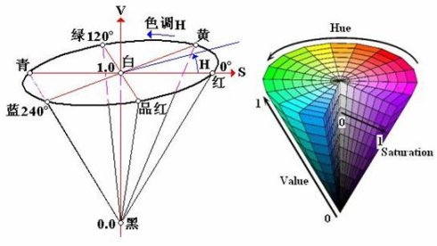

# 颜色选择控件绘制原理分析

支持颜色的设置，当前选择颜色的监听,效果如图


## 原理
颜色的表示有RGB,YUV,HSV,HSL等方式。

- RGB颜色空间，可以表示为一个立方体如图


- YUV 色彩空间，电视系统这种表示方法用的较多，兼容黑白电视，与RGB互转公式为（RGB取值范围均为0-255）：

```

　Y = 0.299R + 0.587G + 0.114B
　U = -0.147R - 0.289G + 0.436B
　V = 0.615R - 0.515G - 0.100B

　R = Y + 1.14V
　G = Y - 0.39U - 0.58V
　B = Y + 2.03U
```

- HSV 可以表示为园柱体



    其中HSV 分别表示色调（hue），饱和度（saturation），值（value）。其颜色模型是一倒置的圆锥体，value等于0的地方为黑色，值为1的横截面中心为白色 
    
Hue： 对应角度

Staturation: 对应到圆心的距离于圆半径的比值

Value ：对应到圆锥顶部的距离


HSV模型在Value值为1的时候，根据颜色能够方便的计算出对应的几何坐标值，根据几何坐标也直接计算出对应的颜色值，到达颜色值与位置对应起来。

## 圆盘的生成原理

固定HSV的value为1，根据当前像素点构成的角度和到圆心的距离计算当前像素对应的颜色值，完成对bitmap的填充。


## 性能对比

色盘生成过程中涉及hsv到rgb的转换，下表分别比较使用不同方法填充bitmap的耗时。


 > 环境: Pixel 2  Android 10

|  方法   |  填充bitmap10次平均耗时  |
|   ---  |      ---     |
| java code | 914.7ms（**优化后122.8ms**） |
| native Color.HSVToColor | 1815.4ms |
| native hsv2rgb | 142.7ms |
| renderscript | 19.1ms |

- `java code`:色盘Bitmap的生成采用java代码完成，hsv转rgb利用`Color.HSVToColor`方法

- `native Color.HSVToColor`:色盘Bitmap的生成采用C++代码完成，hsv转rgb利用Color.HSVToColor方法

- `native hsv2rgb`:色盘Bitmap的生成采用C++代码完成，hsv转rgb利用c++代码实现

- `renderscript`:使用Android的renderscript技术生成bitmap

使用java代码和`Color.HSVToColor`生成色盘性能较低,原因是因为`Color.HSVToColor`会通过JNI调用C++代码完成HSV的转换，当生成大量像素时，这个过程将浪费大量的时间，而且也不利于ART虚拟机对代码优化。在重新使用java代码完成对HSV的转换后，性能明显提升，耗时缩短为原来的13.4%（即表格中的122.8ms)

